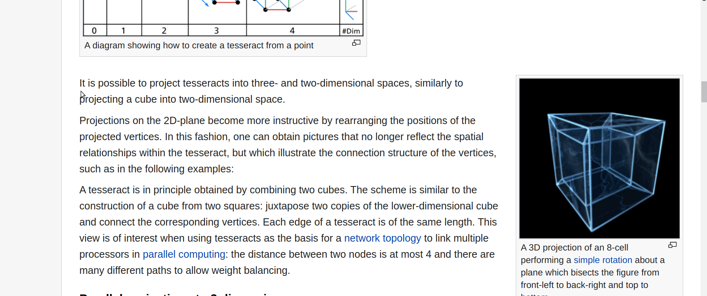

# Copy Img text

Easily copy text from a copied image.





## Installation

Use a virtual environment, or install the app system-wide.

First cd into the cloned project and run the following commands:

```bash
$ sudo pip install wheel
$ sudo pip install .
```

This will install an executable script `cpscreen` in /usr/local/bin directory.

## Usage

Copy an image with some text, or copy a screenshot of an area with text.

```bash
$ cpimgtxt
```

After this, check the clipboard again, and you should find the text extracted from the image inside it.

Obviously you can also bind custom keyboard shortcuts to avoid executing the script from command-line each time.

## Run tests

Make sure you're inside the root of the project.

```bash
$ python setup.py pytest
```