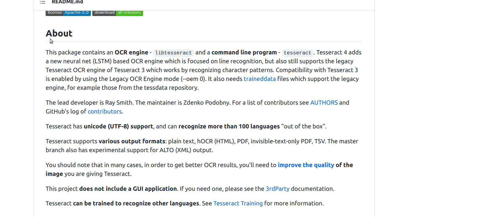

# cpimgtxt

## About

---

**cpimgtxt** uses [Tesseract](https://github.com/tesseract-ocr/tesseract) ocr library for extracting texts from an image and copies the text to a clipboard.

It's supported on Linux distributions, but OSX is also on under way.


## Demo

---

Copy text from a screenshot (using [Flameshot](https://github.com/flameshot-org/flameshot))



Copy text directly from an image:


## Installation

---

Clone this repository:

```bash
$ git clone https://github.com/davidako/cpimgtxt
$ cd copy-img-tex
```

### Debian-based

```bash
$ sudo apt install build-essential libcairo2-dev
$ sudo apt install tesseract-ocr libtesseract-dev
$ sudo apt install libgirepository1.0-dev 
```

Build:
```bash
$ make
```

This will install an executable `cpimgtx` in `~/.local/bin` directory. Unless you ran the command 
with `sudo` of course, in which case it will probably be installed in `/usr/local/bin`.

## Configuration

---

You can change default language by setting the `IMG_LANG` environment variable. Set French for example:

```bash
$ export IMG_LANG='fra'
```

Notice you should use three-digit language codes. See [wiki article](https://en.wikipedia.org/wiki/List_of_ISO_639-1_codes) for reference.

Language code is retrieved in the following order:

 - First check if `IMG_LANG` env variable is set;
 - Then try to guess it from the operating system language
 - If both ways fail, fallback to English

## Usage

---

Copy an image with some text, or copy a screenshot of an area with text.

```bash
$ cpimgtxt
```

After this, check the clipboard again, and you should find the text extracted from the image inside it.

**Obviously you can also bind custom Operating System keyboard shortcuts to avoid executing the script from command-line
each time.**

## Run tests

---

Make sure you're inside the root of the project.

```bash
$ make test
```

## Authors

---

Current implementation:

* [Daviti Magaldadze](https://github.com/davidako/)

## License

--- 

You are free to use this program under the terms of the license found in LICENSE file.